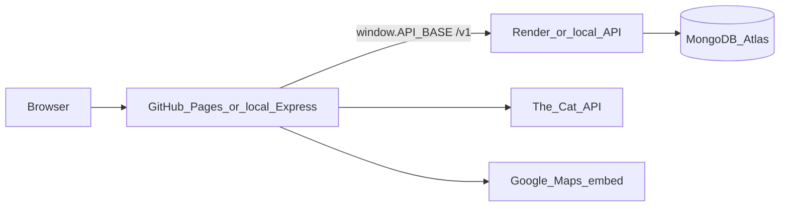
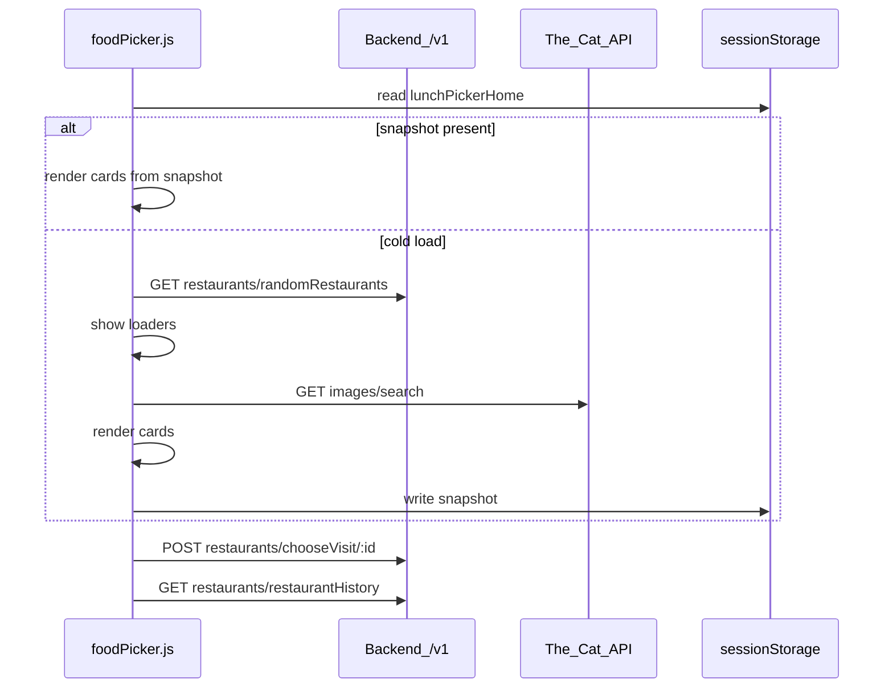
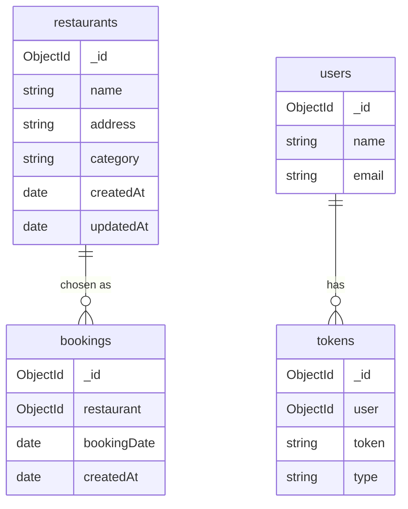
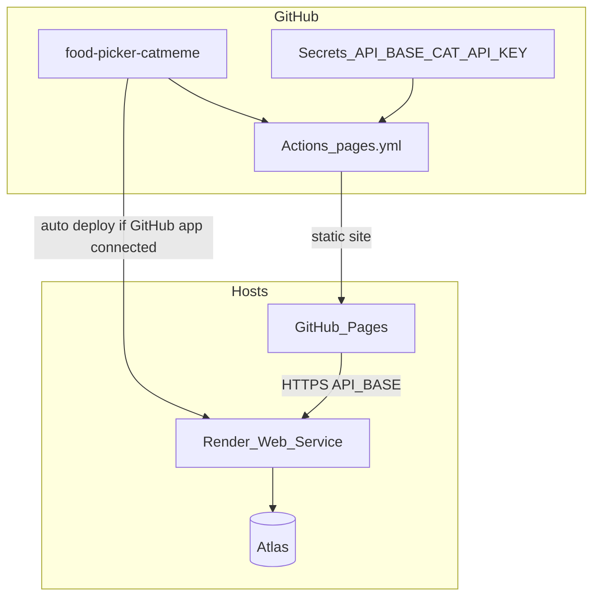

# Architecture

Lunch picker: browser UI + Express/Mongo API + The Cat API for card images.

GitHub: [noowxela/food-picker-catmeme](https://github.com/noowxela/food-picker-catmeme)  
Related SDD notes: [`docs/sdd/000-architecture.md`](sdd/000-architecture.md) · Deploy: [`docs/deploy.md`](deploy.md)

## System overview



| Piece | Local | Production |
| --- | --- | --- |
| UI | `frontend/` Express on **3100** | GitHub Pages |
| API | `backend/` Express on **3000** | Render `food-picker-api` |
| DB | Atlas `project-appxplore` | Same |
| Config | Express route `GET /assets/js/config.js` | CI writes `assets/js/config.js` from Secrets |

## Frontend

Not a SPA. Three HTML pages under `frontend/pages/`, shared CSS/JS under `frontend/assets/`.

| Page | File | Script | Role |
| --- | --- | --- | --- |
| Home | `index.html` | `foodPicker.js` | Random restaurants + cat cards, choose lunch |
| Restaurants | `restaurants.html` | `restaurantPage.js` | List, filter, CRUD, info modal |
| History | `history.html` | (minimal) | Shown via Home history panel / bookings |

### Local server

[`frontend/app.js`](../frontend/app.js):

- Serves pages at `/`, `/home`, `/restaurants`, `/history` (and `*.html` aliases)
- Generates `config.js` with `window.API_BASE` and `window.CAT_API_KEY` from `.env`
- Static assets under `/assets`

### Production static site

[`frontend/scripts/build-static-site.sh`](../frontend/scripts/build-static-site.sh) flattens:

```text
site/
  index.html
  restaurants.html
  history.html
  main.js
  assets/...
  assets/js/config.js   # written from API_BASE + CAT_API_KEY
```

Nav and assets use relative paths (`index.html`, `assets/...`) so the UI works under `/food-picker-catmeme/` on GitHub Pages.

### Client config and API base

```javascript
const ENDPOINT = window.API_BASE || "http://localhost:3000/v1/";
```

Used in `foodPicker.js` and `restaurantPage.js`. Cat key stays in the browser (client calls The Cat API directly).

### Home data flow



Notable Home behavior (see SDDs `001`, `002`):

- Snapshot key `lunchPickerHome` (restaurants, cat URLs, refresh click times)
- Refresh cats: max 3 clicks in a rolling 20s window
- Choose lunch opens a Bootstrap modal + Maps embed; address is not on the card back

### Restaurants page

- Paginated `GET /v1/restaurants` (default limit 10)
- Top + bottom `.restaurant-pagination`
- Row click / Info → view-only modal; Delete → confirm modal
- Layout spacer keeps short last pages from shifting the table

## Backend

Express boilerplate under `backend/src/`. Entry: `src/index.js` (mongoose connect, then listen). App: `src/app.js` (helmet, cors open, rate limit, passport JWT, `/v1` routes). Node **24**, Express **5**, Mongoose **9**.

### API surface used by the UI

Prefix: `/v1/restaurants`

| Method | Path | Purpose |
| --- | --- | --- |
| GET | `/` | List + filter + paginate |
| POST | `/` | Create |
| GET | `/:id` | Get one |
| PATCH | `/:id` | Update |
| DELETE | `/:id` | Delete |
| GET | `/randomRestaurants` | Random set for Home |
| GET | `/restaurantHistory` | Recent choices |
| POST | `/chooseVisit/:id` | Record booking |

Also present (unused by the lunch UI): `/v1/auth`, `/v1/users` (JWT boilerplate).

Restaurant routes are unauthenticated; CORS is `cors()` with no origin allowlist.

### Layering

```text
routes/v1 → controllers → services → models (Mongoose plugins: toJSON, paginate)
```

Validation: Joi in `validations/`. Config: Joi-checked env in `config/config.js` (`NODE_ENV`, `PORT`, `MONGODB_URL`, `JWT_*`; SMTP optional).

## Data model

Database: Atlas **`project-appxplore`**.



Cat images are **not** stored. Names must be unique (`Restaurant.isNameTaken`).

## Deploy architecture



| Concern | Choice |
| --- | --- |
| UI host | GitHub Pages (static only) |
| API host | Render free Node service, `NODE_VERSION=24.21.0` (Express 5, Mongoose 9) |
| Build | `npm --prefix backend ci` then `npm run start:render` |
| Blueprint | [`render.yaml`](../render.yaml) |
| Cold start | Free Render sleeps after idle |

Push to `main` rebuilds Pages when secrets exist. API auto-redeploy needs the Render GitHub app linked to the repo; otherwise redeploy from the Render dashboard.

## Security notes

- `CAT_API_KEY` is public in the browser by design
- Restaurant API has no auth; treat as a demo
- Do not commit `.env`; use GitHub Secrets / Render env for production
- Prefer HTTPS `API_BASE` on Pages (mixed content otherwise)

## Key files

| Path | Why |
| --- | --- |
| `frontend/app.js` | Local UI server + config injection |
| `frontend/assets/js/foodPicker.js` | Home picker |
| `frontend/assets/js/restaurantPage.js` | Restaurant list |
| `frontend/scripts/build-static-site.sh` | Pages artifact |
| `backend/src/index.js` | API process entry |
| `backend/src/routes/v1/restaurant.route.js` | Lunch API routes |
| `backend/src/models/restaurant.model.js` | Restaurant schema |
| `.github/workflows/pages.yml` | Pages CI |
| `render.yaml` | Render service shape |
